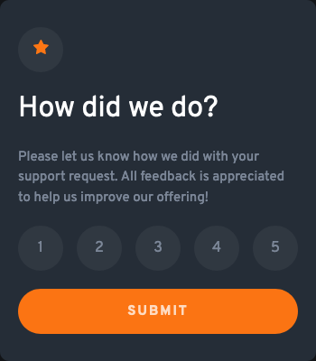

# Frontend Mentor - Interactive rating component solution

This is a solution to the [Interactive rating component challenge on Frontend Mentor](https://www.frontendmentor.io/challenges/interactive-rating-component-koxpeBUmI). Frontend Mentor challenges help you improve your coding skills by building realistic projects. 

## Table of contents

- [Overview](#overview)
  - [The challenge](#the-challenge)
  - [Screenshot](#screenshot)
  - [Links](#links)
- [My process](#my-process)
  - [Built with](#built-with)
  - [What I learned](#what-i-learned)

## Overview

### The challenge

Users should be able to:

- View the optimal layout for the app depending on their device's screen size
- See hover states for all interactive elements on the page
- Select and submit a number rating
- See the "Thank you" card state after submitting a rating

### Screenshots




### Links

- Live Site URL: [https://alicee88.github.io/interactive-rating/](https://alicee88.github.io/interactive-rating/)

## My process

### Built with

- Vanilla HTML/CSS/JS
- Flexbox

### What I learned

This was my first Frontend Mentor challenge and I was happy I could pull together a solution in a relatively short amount of time. 
I had never styled round elements/buttons before so it was good to get experience of ```border-radius``` and the alpha properties on hsl to delineate the borders.  